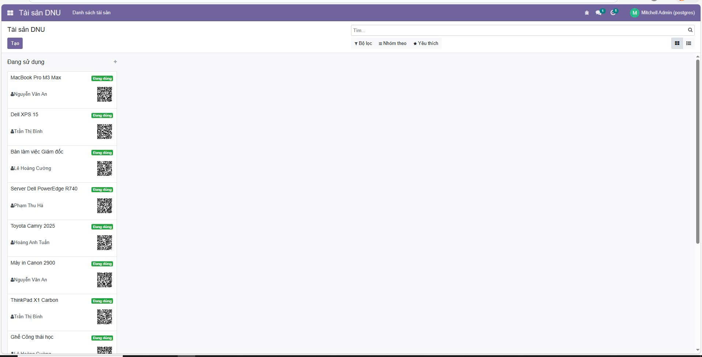
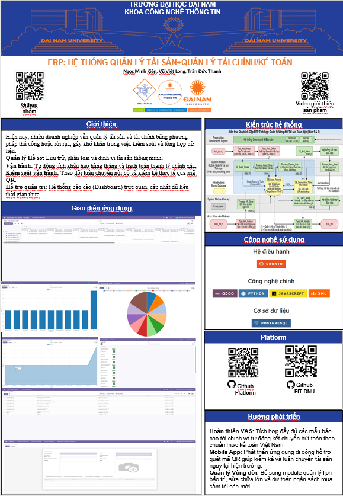

<h2 align="center">
    <a href="https://dainam.edu.vn/vi/khoa-cong-nghe-thong-tin">
    🎓 Faculty of Information Technology (DaiNam University)
    </a>
</h2>
<h2 align="center">
    PLATFORM ERP
</h2>
<div align="center">
    <p align="center">
        
        
        
    </p>

[](https://www.facebook.com/DNUAIoTLab)
[](https://dainam.edu.vn/vi/khoa-cong-nghe-thong-tin)
[](https://dainam.edu.vn)

</div>
# 🏢 Hệ thống Quản lý Tài sản Doanh nghiệp (Enterprise Asset Management)
Hệ thống ERP chuyên nghiệp được xây dựng trên nền tảng Odoo, tích hợp chặt chẽ quy trình Quản lý Tài sản với Nguồn nhân lực (HRM) và Kế toán (Accounting). 

## 1 Giới thiệu Dự án
Dự án nhằm tự động hóa vòng đời của một tài sản từ khi định hình mua sắm, phân bổ sử dụng, khấu hao định kỳ, đến lúc thanh lý xuất toán. 
Hệ thống cung cấp cái nhìn 360 độ về chi phí tài sản trên phương diện tài chính, đồng thời hỗ trợ quản lý định danh vật lý (QR Code), lịch bảo trì tự động và theo dõi biến động nhật ký (Chatter/Audit Trail).

## 🔧 2. Các công nghệ được sử dụng
<div align="center">

### Hệ điều hành
[](https://ubuntu.com/)
### Công nghệ chính
[](https://www.odoo.com/)
[](https://www.python.org/)
[](https://developer.mozilla.org/en-US/docs/Web/JavaScript)
[](https://www.w3.org/XML/)
### Cơ sở dữ liệu
[](https://www.postgresql.org/)
</div>

## 🚀 3. Các project đã thực hiện dựa trên Platform

Một số project sinh viên đã thực hiện:
- #### [Khoá 15](./docs/projects/K15/README.md)

## 4 Kiến trúc Modules
Hệ thống bao gồm hệ sinh thái các module liên kết chặt chẽ với nhau:
* **`quan_ly_tai_san`** (Core): Module gốc quản lý Dashboard, danh mục tài sản, kiểm kê, đơn mượn trả, phân bổ và luân chuyển tài sản. Liên kết chặt chẽ với module Nhân sự chuẩn (`hr`).
* **`dnu_accounting_asset`** (Extension): Model kế thừa siêu cấu trúc, mang đến **Tự động hóa Mức 2 và Mức 3** liên quan đến hạch toán và khấu hao dài hạn.
* **`dnu_asset` & `nhan_su`** (Base): Khung sườn quản trị cơ sở độc lập gồm chứng chỉ, cấp bậc nhân viên và dữ liệu định danh vật lý sơ cấp.

## 5 Các Tính năng Đột phá (Mức 1 đến Mức 2)
1. **Tích hợp HRM & Kế toán (Mức 1):** Ràng buộc bàn giao tài sản dựa trên trạng thái nghỉ việc của nhân viên quản lý một cách linh hoạt qua REST Request.
2. **Khấu hao & Bút toán Tự động (Mức 2):** 
   - Tự động sinh bảng Kế hoạch Khấu hao dự kiến kéo dài nhiều năm.
   - **Cron Job Kế toán:** Lịch trình chạy ngầm hàng tháng tự động sinh sổ nhật ký `account.move` mà không cần thao tác bấm xác nhận thủ công.
3. **Thanh lý Tài sản (Asset Disposal):** Wizard ghi nhận tài sản thanh lý. Tự động `cancelled` vạch khấu hao tương lai, đồng thời tạo cụm Bút toán *Ghi giảm TSCĐ*, *Chi tiết cấu thành tài sản* và *Doanh thu thanh lý* nội trong một Database Transaction duy nhất giúp bảo toàn toàn vẹn dữ liệu (ACID).
4. **QR Code Inventory:** Dynamic Gen mã QR cho phép quét điện thoại trỏ thẳng URL vào hồ sơ tài sản (Form View).
5. **Dashboard Báo cáo Tài chính (Pivot & Graph):** Ứng dụng SQL Aggregation của Postgres đẩy tải từ Backend Python, phân rã Chi phí khấu hao và Nguyên giá theo "Phòng ban" cực kỳ tối ưu RAM.
6. **Bảo trì Định kỳ Tự động:** Server check định kỳ rạng sáng, hệ thống tự động chèn Action/Todo nhắc nhở nhân viên 3 ngày trước hạn bảo trì.

## ⚙️ 6. Cài đặt

### 6.1. Cài đặt công cụ, môi trường và các thư viện cần thiết

#### 6.1.1. Tải project.
```
git clone (https://github.com/ngocminhkien/NHOM_5_HN-QTPMDN_BTL.git)
```
#### 6.1.2. Cài đặt các thư viện cần thiết
Người sử dụng thực thi các lệnh sau đề cài đặt các thư viện cần thiết

```
sudo apt-get install libxml2-dev libxslt-dev libldap2-dev libsasl2-dev libssl-dev python3.10-distutils python3.10-dev build-essential libssl-dev libffi-dev zlib1g-dev python3.10-venv libpq-dev
```
#### 6.1.3. Khởi tạo môi trường ảo.
- Khởi tạo môi trường ảo
```
python3.10 -m venv ./venv
```
- Thay đổi trình thông dịch sang môi trường ảo
```
source venv/bin/activate
```
- Chạy requirements.txt để cài đặt tiếp các thư viện được yêu cầu
```
pip3 install -r requirements.txt
```
### 6.2. Setup database

Khởi tạo database trên docker bằng việc thực thi file dockercompose.yml.
```
sudo docker-compose up -d
```
### 6.3. Setup tham số chạy cho hệ thống
Tạo tệp **odoo.conf** có nội dung như sau:
```
[options]
addons_path = addons
db_host = localhost
db_password = odoo
db_user = odoo
db_port = 5431
xmlrpc_port = 8069
```
Có thể kế thừa từ file **odoo.conf.template**
### 6.4. Chạy hệ thống và cài đặt các ứng dụng cần thiết
Lệnh chạy
```
python3 odoo-bin.py -c odoo.conf -u all
```
Người sử dụng truy cập theo đường dẫn _http://localhost:8069/_ để đăng nhập vào hệ thống.
------

## 7 Luồng nghiệp vụ: Từ lúc mua đến lúc thanh lý (Business Flow)
*(Mô tả phân đoạn để dựng biểu đồ mô hình hóa - Mermaid/Flowchart)*

1. **Khởi tạo Tài sản (Draft State):** Kế toán viên hoặc Quản trị viên nhập thông tin "Nguyên giá", "Loại tài sản", "Thời gian khấu hao dự kiến". Tài sản mới chưa tham gia vào CSDL Kế toán.
2. **Cấp phát & Bắt đầu sử dụng (In Use State):** 
   - Chọn "Nhân viên sử dụng" (Cơ chế Constrain: Chặn cấp phát nếu nhân viên đã nghỉ việc).
   - Nhấn hành động `Xác nhận bắt đầu sử dụng`: Hệ thống tự nội quy sinh Bảng Lịch trình Khấu hao các kỳ tương lai (Draft Depreciation Lines). Chuyển trạng thái sang `in_use`. Sinh tự động mã định danh QR Code.
3. **Luân chuyển / Mượn trả (Lifecycle Logging):** Người dùng tạo phiếu Luân chuyển, hệ thống ghi đè Bộ phận sử dụng mới để điều hướng chi phí hạch toán sang đúng phòng ban sau này.
4. **Khấu hao định kỳ (Auto-Depreciation via Cron):** Đến ngày đã định của mỗi tháng, Hệ thống Scheduler ngầm chạy rà soát Bảng lịch trình, khóa (`POST`) bút toán sổ nhật ký (`account.move`), qua đó hạch toán Nợ 214/Có ABC và tự cập nhật trừ "Giá trị còn lại".
5. **Bảo trì tài sản (Maintenance Phase):** CSDL theo dõi ngày bảo trì định kỳ. Trước 3 ngày, Cron Job gắp đúng Account của nhân viên đang giữ tài sản để sinh một Mail Activity Todo dội về Notification Odoo của họ.
6. **Thanh lý tài sản (End of Life / Disposal):** 
   - Kế toán nhấn "Thanh lý", khai báo "Giá bán / Giá thanh lý".
   - Hệ thống ra lệnh `Update` chốt chặn: HỦY (`cancelled`) các dòng lịch trình khấu hao còn dang dở.
   - Khởi tạo cụm bút toán đồng thời: Ghi giảm 211, Tăng Khấu hao lũy kế 214, Gắn vào Chi phí thanh lý 811 hoặc Ghi nhận Thu nhập khác 711. Kết nối với Tiền mặt 111.
   - Tài sản chính thức chuyển về trạng thái `Disposed` - Đóng rào vĩnh viễn vòng đời của tài nguyên vật lý này.
📝 8. Các Module chức năng chính
8.1. Module Quản lý Nhân sự (nhan_su)
Module Quản lý nhân sự đóng vai trò là nền tảng dữ liệu gốc, giúp thiết lập cơ cấu tổ chức và quản lý thông tin nhân sự để phục vụ việc gán trách nhiệm sở hữu tài sản.

<p align="center">

</p>
<p align="center">

</p>

Quản lý thông tin nhân viên: Lưu trữ đầy đủ dữ liệu cá nhân bao gồm mã định danh, họ tên, ngày sinh, quê quán, email và ảnh chân dung.

Tự động hóa hồ sơ: Hệ thống tự động tính toán tuổi dựa trên ngày sinh và hỗ trợ quản lý danh sách chứng chỉ, bằng cấp đi kèm.

Tích hợp quản lý tài sản: Thiết lập các Tab chuyên biệt (Tài sản đang giữ, Quản lý cấp phát) để theo dõi tức thời các tài sản mà nhân viên đang chịu trách nhiệm, làm cơ sở cho quy trình thu hồi khi có biến động nhân sự.

8.2. Module Quản lý Tài sản (dnu_asset)
Đây là module cốt lõi cho phép doanh nghiệp theo dõi toàn bộ vòng đời của tài sản từ khâu nhập kho, cấp phát đến khi thanh lý.

<p align="center">

</p>
<p align="center">

</p>

Quản lý danh mục tài sản: Hệ thống hóa tài sản theo mã, tên và loại (Thiết bị CNTT, Máy chủ, Nội thất, Phương tiện vận tải...).

Công nghệ QR Code: Tích hợp tính năng tự động sinh mã QR định danh cho từng tài sản. Mã QR được hiển thị trực tiếp trên giao diện Kanban giúp việc kiểm kê thực địa trở nên nhanh chóng và chính xác.

Quản lý trạng thái trực quan: Theo dõi tình trạng tài sản (Đang sử dụng, Bảo trì, Hỏng) thông qua hệ thống thẻ màu và giao diện Kanban hiện đại, cập nhật dữ liệu theo thời gian thực.

Kiểm soát trách nhiệm: Ghi nhận chi tiết nhân viên sử dụng và vị trí lắp đặt tài sản, đảm bảo tính minh bạch trong việc khai thác tài nguyên doanh nghiệp.

8.3. Module Tích hợp Kế toán & Tài chính (dnu_accounting_asset)
Module cao cấp hỗ trợ tự động hóa các nghiệp vụ tài chính phức tạp, giúp liên thông dữ liệu từ chứng từ gốc đến sổ cái kế toán.


<p align="center">

</p>


Quản lý chứng từ gốc: Liên kết trực tiếp hóa đơn mua tài sản (Invoice) để xác lập nguyên giá, ngày mua và các sắc thuế đi kèm làm căn cứ hạch toán.

Tự động hóa khấu hao: Xây dựng logic tự động trích lập bảng khấu hao hàng tháng dựa trên phương pháp đường thẳng, tự động tạo bút toán kế toán vào các tài khoản 211 và 642.

Báo cáo Pivot đa chiều: Cung cấp bảng phân tích tài chính chuyên sâu, cho phép theo dõi giá trị còn lại và mức khấu hao lũy kế theo từng loại tài sản và thời gian.

Dashboard phân tích trực quan: Hệ thống biểu đồ tròn, cột và đường giúp ban lãnh đạo theo dõi cơ cấu tài sản và biến động chi phí một cách nhanh chóng và chính xác.
## 📝 9. Poster Nhóm 12
  <p align="center">
        
    </p>
